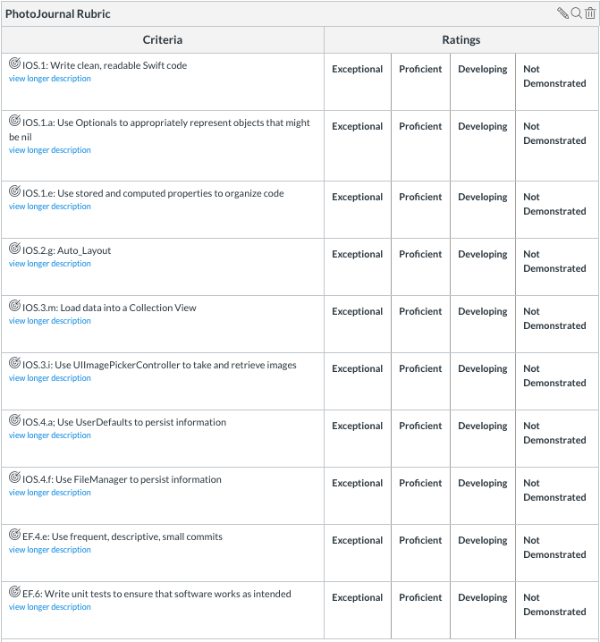

# Pursuit-Core-iOS-PhotoJournal-Assignment

Build a PhotoJournal app that uses the user's camera or photo library to create photo journals. Your app should persist the user's photo journals to the documents directory via FileManager.

## Github

- create your own repo
- commit often to your repo
- submit your final repo link to canvas

## Requirements: 

### PhotoJournal Entries View Controller

- Use a collection view to display photo journals.
- The View Controller should have a bottom toolbar with a "+" button and a gear button.
- Pressing on the "+" button modally presents a View Controller where the user can add a new entry.
- Pressing on the gear button modally presents a View Controller where the user can edit their settings.

#### PhotoJournal Collection View Cell Actions

- The user should be able to delete a photo journal.
- The user should be able to edit a photo journal (using the PhotoJournal Entry View Controller).
- The user should be able to share a photo journal by using the UIActivityViewController.

### Add PhotoJournal Entry View Controller

- The View Controller should have a Text View, an Image View, and a bottom toolbar.
- The bottom toolbar should have two Bar Button Items: "Photo Library" and "Camera".
- Pressing on the camera should allow them to take a photo for their journal (Note, this doesn't work on simulator).
- The View Controller should also have `cancel` and `save` Bar Button Items in the top toolbar.
- Pressing save should save the photo journal to the user's collection of photo journals using `FileManager`.
- Pressing save should dismiss the View Controller and shows the user the collection of all PhotoJournal Entries. 
- Pressing cancel should also dismiss the View Controller and shows the user the collection of all PhotoJournal Entries, without persisting the new PhotoJournal.
- Add validations to make sure that the user has entered all necessary information when they hit save.

### Settings View Controller

- Include an option for setting the scroll direction of the Collection View.
- Include an option for setting the background color.
- All settings should be persisted to UserDefaults.

## Rubric

## Sample gif of completed Photo Journal 

  

